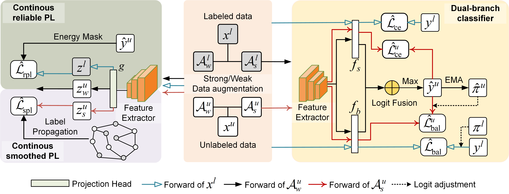

# [NeurIPS'24] Continuous Contrastive Learning for Long-Tailed Semi-Supervised Recognition

<!-- This is PyTorch implementation of Continuous Contrastive Learning for Long-Tailed Semi-Supervised Recognition. -->
This is PyTorch implementation of [Continuous Contrastive Learning for Long-Tailed Semi-Supervised Recognition] at NeurIPS 2024.
## Abstract
Long-tailed semi-supervised learning is a challenging task that aims to train a model using limited labeled data that exhibit a long-tailed label distribution. State-of-the-art LTSSL methods rely on high-quality pseudo-labels assigned for large-scale unlabeled data. However, most of them overlook the effect of representations learned by the network and are often less effective when dealing with unlabeled data from the real world, which typically follows a distinct distribution compared to the labeled data.In this paper, we present a probabilistic framework that unifies many recent proposals to cope with long-tail learning problems. Our framework deduces the class-balanced supervised contrastive loss when employing the Gaussian kernel density estimation, and generalizes to unlabeled data based on reliable and smoothed continuous pseudo-labels. We progressively estimate the underlying distribution and optimize its alignment with model predictions to address the agnostic distribution of unlabeled data in the real world.Extensive experiments on several datasets with varying unlabeled data distribution show the advantage of our proposal over previous state-of-the-art methods, e.g., more than 4% improvements on ImageNet-127. The source code is available in the supplementary material.

## Method

<p align = "center">

</p>

## Requirements

- Python 3.7.13
- PyTorch 1.12.0+cu116
- torchvision
- numpy
- progress


## Dataset

The directory structure for datasets looks like:
```
datasets
├── cifar-10
├── cifar-100
├── stl-10
├── imagenet32
└── imagenet64
```

## HardWare
Most experiments can be reproduced using a single GPU with 24GB of memery (larger dataset such as imagenet64 need to use multi GPU parallel).

## Usage
To train proposed method on different setting, run
```
python train.py --dataset [data] --num-max [N1] --num-max-u [N2] --arch [model] --imb-ratio-label [3] --imb-ratio-unlabel [N4] --flag-reverse-LT [B1]
```
The [data] can be the name of datasets, including 'cifar10', 'cifar100', 'stl10', 'smallimagenet', etc.

The [model] can be the name of backbone, including 'wideresnet', 'resnet', etc.

[N1], [N2] denote the max number of labeled and unlabeled data. They should be integers greater than 0

[N3], [N4] denote the imbalanced ratio of labeled and unlabeled data. They should be integers greater than 1.

[B1] denote whether to reverse the distribution of the unlabeled data. Its should be It should be a logical value.


## Usage Examples

For example, train our proposed CCL on CIFAR100-LT of different settings.

For consistent:

```
python train.py --dataset cifar100 --num-max 50 --num-max-u 400 --arch wideresnet --batch-size 64 --lr 0.03  --imb-ratio-label 10 --imb-ratio-unlabel 10  --out out/cifar-100/N50_M400/consistent_10
```

For uniform:

```
python train.py --dataset cifar100 --num-max 50 --num-max-u 400 --arch wideresnet --batch-size 64 --lr 0.03 --imb-ratio-label 10 --imb-ratio-unlabel 1 --out out/cifar-100/N50_M400/uniform_10  
```

For reversed:

```
python train.py --dataset cifar100 --num-max 50 --num-max-u 400 --arch wideresnet --batch-size 64 --lr 0.03  --imb-ratio-label 10 --imb-ratio-unlabel 10  --flag-reverse-LT 1 --out out/cifar-100/N50_M400/reversed_10
```
More commands for running other settings can be found in the Configs file. 

## Acknowledgement
Our code of CCL is based on the implementation of FixMatch. We thank the authors of the [FixMatch](https://github.com/kekmodel/FixMatch-pytorch) for making their code available to the public.

## Citation
@inproceedings{zhou2024CCL,
  title={Continuous Contrastive Learning for Long-Tailed Semi-Supervised Recognition},
  author={Zi-Hao Zhou and Si-Yuan Fang and Zi-Jing Zhou and Tong-Wei and Yuan-Yu Wan and Min-Ling Zhang},
  booktitle={Advances in Neural Information Processing Systems 37},
  year={2024}
}


